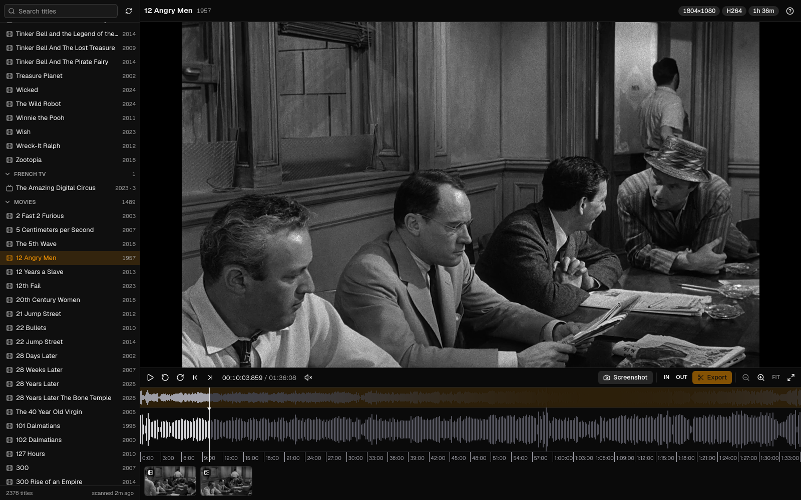
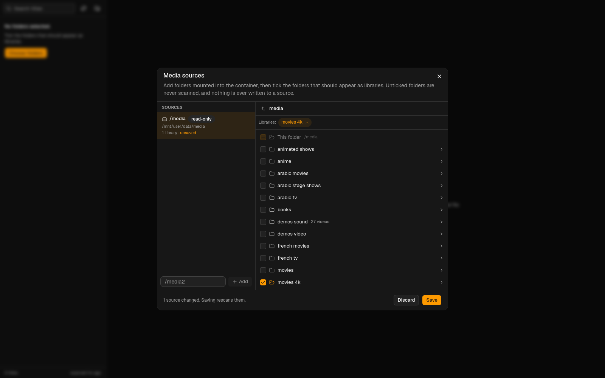

<p align="center">
  
</p>

<h1 align="center">Reel Vault</h1>

<p align="center">A small, self-hosted, Plex-style video player for one job: grabbing full-quality screenshots and trimming clips from your media library.</p>

Reel Vault points at a read-only media share, shows your movies and shows in a compact sidebar, and plays anything in the browser through a lightweight preview transcode. Every capture is cut from the **original file**, never from the preview, and lands in an output folder named after the movie or show. No GPU, no database, no accounts. It runs on port **7727**.



## Features

- **Plays everything.** MKV, MP4, AVI, TS and friends with H.264, HEVC, AV1, 10-bit and HDR video and AC3, DTS, TrueHD or AAC audio all stream as an on-the-fly HLS preview (H.264 and AAC, up to 1080p). Seeking anywhere in a 60 GB remux starts within a couple of seconds.
- **Frame-accurate screenshots** as PNG or JPEG at the source resolution or scaled to 1080p, 720p or any width. HDR10, HLG and Dolby Vision (profiles 7 and 8) are tone-mapped to SDR so grabs look right.
- **Clip trimming.** Set in and out points on the timeline, then export an MP4 (H.264 and AAC) cut precisely from the original, at source resolution or 1080p/720p, in three quality levels, with or without audio, with progress and cancel.
- **A timeline built for precision.** Waveform, ruler, minimap, drag-to-select, draggable in and out handles, zoom at the pointer with Ctrl and the mouse wheel, frame stepping, and hover thumbnails.
- **Your folders, your libraries.** Mount one or more media shares read-only, browse them in the app and tick exactly which folders become libraries (a whole `movies 4k` share or a single sub-folder). Unticked folders are never scanned. Search, lazy-loaded seasons and episodes, and periodic rescans included.

## Quick start

```bash
docker run -d --name reel-vault \
  -p 7727:7727 \
  -v /path/to/media:/media:ro \
  -v /path/to/captures:/output \
  -v /path/to/appdata/reel-vault:/config \
  -e PUID=99 -e PGID=100 -e TZ=Europe/London \
  --restart unless-stopped \
  ghcr.io/sufxgit/reel-vault:latest
```

Or with Compose: edit the paths in [docker-compose.yml](docker-compose.yml) and run `docker compose up -d`. Then open `http://<host>:7727`.

## Install on Unraid

The template lives at [unraid/reel-vault.xml](unraid/reel-vault.xml). Unraid 7 has no field for pasting a template URL, so drop the file on the flash drive:

1. Open **Tools > Terminal** and run:
   ```bash
   wget -O /boot/config/plugins/dockerMan/templates-user/my-ReelVault.xml \
     https://raw.githubusercontent.com/SuFxGIT/reel-vault/main/unraid/reel-vault.xml
   ```
2. Go to **Docker > Add Container**, open the **Template** dropdown and pick **ReelVault** under *User templates*.
3. Check the three paths (the media library is mounted read-only, captures go to the output path, config holds caches) and click **Apply**.
4. Optionally switch on **Autostart** in the Docker tab.

The timezone is picked up from Unraid automatically. PUID and PGID default to 99 and 100 (nobody:users) so captures are readable over your shares. The image is published on GitHub Container Registry; if the package is private, log in first with `docker login ghcr.io`.

Developing on the Unraid box itself? `node scripts/unraid-run.mjs --install-template --recreate` builds the same `docker run` command Unraid would, registers the template and icon, and starts the container.

## Media sources

Reel Vault does not scan a mount blindly. Each mounted folder is a **source**, and inside a source you choose which folders become libraries:

1. Mount your media into the container read-only (`/media` in the template; add `/media2`, `/media3` or any other container path for more shares).
2. Open **Media sources** (the folder icon at the top of the sidebar). Mounted folders that are not added yet appear as one-click suggestions; you can also type a container path.
3. Browse the source and tick the folders to import. A folder at any depth can be a library, including the source root itself, but libraries cannot nest. Click a library chip to rename it.
4. Save. Only the ticked folders are scanned; everything else stays hidden. Each ticked folder shows up as its own library in the sidebar.



Sources are stored in `/config/sources.json`. On first start, `/media` is registered automatically but nothing is imported until you pick folders. The app only ever reads from a source: it never renames, moves, deletes or writes media files, and the dialog warns when a source is mounted read-write.

The same operations are available over the API: `GET /api/sources`, `POST /api/sources {"path":"/media2"}`, `GET /api/sources/:id/browse?path=movies`, `PUT /api/sources/:id/libraries {"libraries":[{"relPath":"movies 4k"},{"relPath":"demos video","name":"Demos"}]}`, `DELETE /api/sources/:id`.

## Paths and environment

| Path | Mode | Purpose |
|---|---|---|
| `/media` | read-only | Your main media share. Pick the folders to import under Media sources. Never written to. |
| `/media2`, `/media3`, ... | read-only | Optional extra shares. Any container path works; add it under Media sources. |
| `/output` | read-write | Screenshots (numbered PNG or JPEG) and clips (MP4), one folder per movie or show. |
| `/config` | read-write | Library index, probe and waveform caches, and the temporary transcode segments. Safe to delete. |

| Variable | Default | Purpose |
|---|---|---|
| `PUID` / `PGID` | `99` / `100` | User and group the app runs as; captures are owned by them. |
| `TZ` | `UTC` | Timezone for logs (Unraid sets it for you). |
| `LOG_LEVEL` | `info` | `trace`, `debug`, `info`, `warn` or `error`. `debug` logs every ffmpeg command line. |
| `SCAN_INTERVAL_MINUTES` | `60` | How often the selected folders are rescanned. `0` disables periodic scans. |
| `MEDIA_PATH` | `/media` | The mount registered as the first source on first start. |
| `CLIP_MAX_SECONDS` | `1800` | Longest clip the export accepts. |
| `PORT` | `7727` | Container port. Change the host side of the mapping instead. |

## How it works

- **Library.** Only the folders you ticked are walked (a 1,500 movie folder takes a couple of seconds) and the result is cached in `/config/library.json`, so restarts are instant. Movies and shows are recognised from their folder structure, not from the library name: `Show (2022)/Season 01/Show - S01E01 - Title.mkv` is a show, `Movie (1999)/Movie (1999).mkv` is a movie. Episode names like `S01E01`, `S01E01-E02`, `21x1088`, `Ep14` and bare numbers inside a season folder all work.
- **Preview.** The server runs ffmpeg per title, producing a 4 second fragmented-MP4 HLS stream (H.264 and AAC, at most 1080p) that hls.js feeds to the browser. Seeking outside the buffered range restarts ffmpeg at that exact segment, so any codec plays and only the part you watch is transcoded. Idle transcodes stop after a minute.
- **Captures use the original file.** A screenshot decodes the exact frame at the timestamp and writes it at source resolution unless you asked for a smaller size. A clip re-encodes the selected range from the source into an MP4 that plays anywhere. HDR sources go through `zscale` and `tonemap` to BT.709 for both, and any downscale happens before tone-mapping.
- **Output layout.** Screenshots are numbered: `/output/<Title (Year)>/1.png`, `2.jpg`, ... for movies and `/output/<Show (Year)>/S01E02/1.png` for episodes; deleting one renumbers the rest so they always run 1 to n. Clips keep their time range: `/output/<Title (Year)>/<Title (Year)> - <in> to <out>.mp4` (episodes add ` - S01E02`). Unicode titles are kept as they are. The strip under the timeline shows the numbered screenshots in order, then clips; drag a screenshot to change its position and the files are renumbered to match (the leftmost is 1). Each tile has download and delete buttons.

## Export options

The small arrow next to **Screenshot** and **Export** opens the options for that capture. They are remembered per browser, and the `S` and `E` shortcuts reuse the last choices.

| Screenshot | Choices |
|---|---|
| Format | PNG (lossless) or JPEG (quality 92) |
| Size | Source, 1080p, 720p, or a custom maximum width |

| Clip | Choices |
|---|---|
| Size | Source, 1080p or 720p |
| Quality | High (CRF 18), Balanced (CRF 20) or Small (CRF 24, faster) |
| Audio | The track selected in the header, or none |

Sizes are width limits that keep the source aspect ratio, so a 2.39:1 film at "1080p" comes out 1920×804. The API accepts the same fields: `POST /api/items/:id/screenshot {"t":600,"format":"jpeg","maxWidth":1920}` and `POST /api/items/:id/clip {"start":60,"end":70,"quality":"small","maxWidth":1280,"audio":-1}`.

## Keyboard shortcuts

| Key | Action |
|---|---|
| `Space` | Play or pause |
| `←` `→` | Back or forward 5 seconds |
| `Shift` + `←` `→` | Back or forward 1 second |
| `,` `.` | Previous or next frame |
| `I` `O` | Set the in or out point at the playhead |
| `Backspace` | Clear the selection |
| `S` | Save a screenshot of the current frame |
| `E` | Export the selection as a clip |
| `+` `-` `0` | Zoom the timeline in, out, or to fit |
| `Ctrl` + wheel | Zoom the timeline at the pointer (plain wheel scrolls) |
| `F` | Fullscreen |
| `M` | Mute |
| `/` | Focus the library search |

Dragging on the waveform creates a selection; the amber handles adjust it. Clicking the minimap or the waveform seeks.

## Development

```bash
npm install && npm --prefix web install   # server and web dependencies
npm test                                  # naming rules against real-world file names
npm run dev                               # Express server with tsx watch on :7727 (needs ffmpeg on PATH)
npm --prefix web run dev                  # Vite dev server on :5173, proxies /api to :7727
docker compose -f docker-compose.dev.yml up   # the server inside an Alpine container with ffmpeg, against real paths
npm --prefix web run build && npm run build   # production bundles
docker build -t ghcr.io/sufxgit/reel-vault:latest .
npm run icons                             # re-render the PNG icons from logo.svg
node scripts/smoke-browser.mjs --probe    # headless Chrome playback check (see the script header)
```

The server is Node 24 and Express 5 in TypeScript; the web app is React 19, Vite, Tailwind CSS 4 and shadcn/ui, with hls.js for playback and wavesurfer.js for the timeline. ffmpeg comes from Alpine 3.24.

## License

MIT
